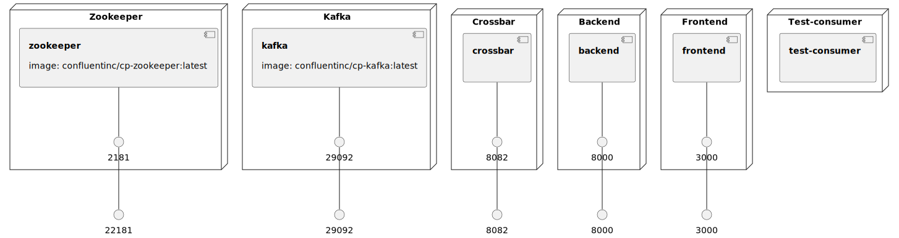

# Mini Python projects
  * [mailsender](./mailsender) - Sample Django app with React front-end
  * [procmon](./procmon) - Sample realtime host metric monitor that uses Django, WAMP router and Kafka

### Infrastructure model

- [backend component model](.infragenie/backend_component_model.svg)

---
